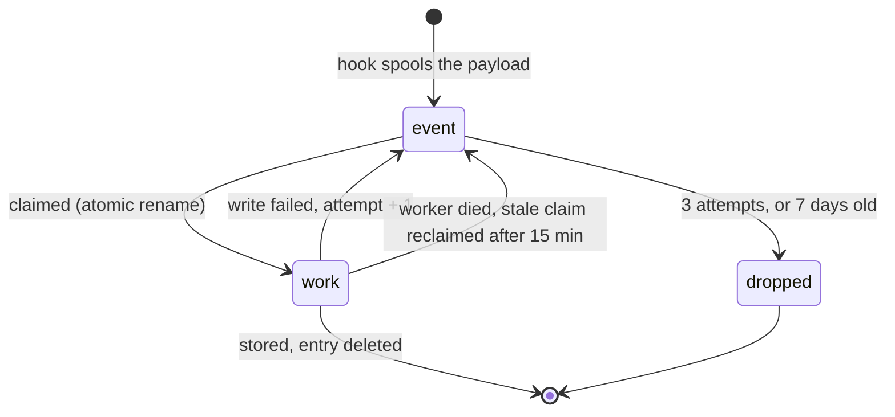
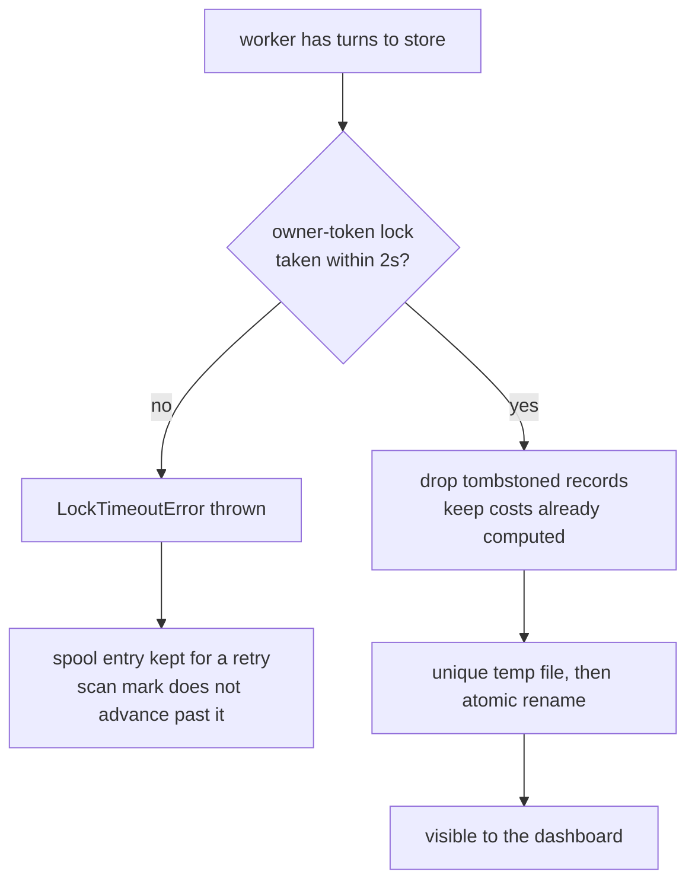

# Internals

How AI Usage Inspector is built, for anyone changing it or auditing what it does on
their machine. Start with the [README](../README.md) if you just want to use it.

- [Provider model](#provider-model)
- [The spool](#the-spool)
- [The write](#the-write)
- [Scan windows](#scan-windows)
- [What each provider reads](#what-each-provider-reads)
- [Configuration in depth](#configuration-in-depth)
- [Model vendors](#model-vendors)
- [Pricing refresh](#pricing-refresh)
- [Dashboard API](#dashboard-api)
- [Project layout](#project-layout)

## Provider model

Every supported agent has a provider module under `src/providers/<id>/`. A provider owns
the hook payload shape, transcript/history discovery, the parser, its pricing table, the
dynamic pricing refresh, and install/uninstall wiring. The shared core owns config, field
stripping, atomic NDJSON upserts, viewer bundling, and the dashboard API.

Every provider emits the same turn-record shape, so the viewer mixes all of them in one
table without provider-specific UI branches. Adding an agent means one folder plus one line
in `src/providers/index.mjs` — there are two templates to copy: hook-plus-transcript
(Claude, Codex) and scan-based (Cursor, OpenCode, the VS Code agents).

Backfill is deliberately synchronous, since it is a CLI you are waiting on:

```text
src/sync.mjs -> provider.discoverTranscripts() -> ingestTranscript() -> .ai-usage/usage.ndjson
```

## The spool

A spooled event is not a fire-and-forget gamble. Each entry changes state by atomic
rename, so only one worker can claim a given entry, and anything left behind by a crashed
worker is picked up later:



Verified by running four workers against eight events at once: exactly eight processed,
none twice and none lost.

## The write

Several agent sessions can write to one project at once, so every write takes a lock and
lands atomically.



The `no` branch matters more than it looks. A write that *could not happen* used to report
the same `0` as a write that legitimately had nothing to do, so a busy lock looked like
success and the work was silently dropped. It now throws, which is what makes the retry
possible.

A lock is stolen only once older than the staleness window — age is the only evidence available
that its owner died — and is only ever removed by its owner. Lines that
are not valid JSON are carried through a rewrite rather than discarded. Twelve processes
writing one file at once lose nothing.

What a write replaces is one transcript's contribution to one session. A provider that keeps a
session in a single source — Cursor, OpenCode, the Cline family — names no transcript, and its
batch replaces the whole session, so a turn that has left the source goes too. Claude and Codex
name the file: Codex continues a reverted thread in a new rollout under the same thread id, and
reading one file must not delete the other's turns. Rows written before rows named their
transcript are replaced wholesale by the session's own transcript, because they can carry ids and
timestamps today's parser no longer produces; any other transcript takes only the turns it can
name. When two sources carry the same turn, the copy holding the work is the one kept. An old,
position-based id identifies which stored row a continuation replaces, but blocks nothing and passes
on nothing — it may have been another turn's — so a continuation turn deleted before its id was
qualified can reappear once; deleting it again sticks.

A session's rows belong to the folder it started in: the first folder its own turns name that still
exists. Turns marked `copied: true` are ignored unless every turn in the session is copied.
A hook reports wherever the agent is when a turn ends, and Claude Code moves a desktop
session into any project subfolder its own commands `cd` into, so storing under the hook's folder
copied whole sessions into subfolders beside the original. The sweep already used the first turn's
folder, so the hook and the sweep now agree. The hook's folder is used only when no folder a turn
names still exists, so a project that moved keeps recording.

`/branch` and `--fork-session` copy earlier turns into a new Claude session and keep each message's
uuid, so a branch's transcript holds turns its original already stored. The holder with the most
tokens keeps the turn, with the original winning ties; branch labels still follow the session
arbitration. Each new Claude row persists `transcriptFirstTs`, the first timestamped entry in
its source transcript. `firstEntryDirection` uses the earliest known source stamp across each
session's rows, including already stored continuation files; a later file's opening is not treated
as the session's birth. Both sides need evidence, the stamps must differ, and the earlier source
must reach back to the shared turn. This settles direction even inside the old 60-second window.
`branchResolution` is `resolved` only with that evidence, otherwise `unresolved`.

Without that evidence (including 2.5.0 rows), the previous rules remain: a prompt more than a
minute older than the source's first entry is marked `copied`; a mark on only one side settles
it. Where the marks agree and only one side has been read by this version, that side keeps the
turn: rows an older version wrote name no first entry, and a batch skipped on timing alone is
never written, so a later pass of the same repair could not put it back. Otherwise compare own
turns before the shared history, then continuation timing, with a session holding only shared
turns preferred. Normal ingestion retains the stored holder on a
heuristic tie. Cleanup sorts session IDs before arbitration, uses a lexical final tie-break for
ownership and equally recent parent labels, and breaks home-folder timestamp ties by normalized
path, so discovery order cannot reverse removal decisions. An incoming copy is skipped only if
a stored holder has at
least as many tokens; an original takes a turn back only if its incoming row has at least as many.
Otherwise the richer stored row stays and the incoming row is dropped, while `branchOf` still
follows arbitration. Token totals use the sum of numeric usage fields, including subagent work.
A turn deleted under the original does not come back through a branch. Only a message uuid can be a
copy: other ids are built from the session and cannot collide, and other providers are left alone.

## Scan windows

Scan-based providers (Cursor, OpenCode) do not rescan a fixed window. Each keeps a durable
high-water mark in `~/.ai-usage-inspector/scan-state.json` and resumes from it with a five
minute overlap, so an outage longer than a day does not quietly drop history.

The mark only advances when a scan both found a healthy store and stored everything it
found. A locked database, a schema the reader does not recognise, or a single failed write
leaves it where it was — and the scan status (`ok`, `locked`, `unsupported-schema`,
`missing`) is recorded, so stale capture is visible rather than looking like an idle day.

An upgrade across a change in how turns are identified or costed records a repair for the
detected providers affected by any crossed epoch. Missing epoch entries mean every provider;
epoch 4 targets OpenCode, epoch 5 targets OpenCode, Cline, Roo Code and Kilo Code,
and epoch 6 targets Claude Code, Cursor, OpenCode, Cline, Roo Code and Kilo Code for GLM repair.
Codex is unaffected by epoch 6; older crossed epochs still accumulate their own debt.
Older pending repairs remain owed; a fresh install or a provider first detected after upgrade
does not acquire a repair just from detection. Until that agent's history has been read in full once, its window
starts at the beginning. Only a pass that reached every transcript it listed settles the repair —
save transcripts that moved while being read, which belong to a live session its hook reads
again. `sync.mjs` honours the same repair, so machines that never sweep (`--local`,
`autoSweep: false`) settle it the first time the dashboard starts. A repair is settled per
destination: a pass into an aggregate `AI_USAGE_DIR` does not count for the rows each project holds.

Before either `worker.rescan` or `sync` ingests an owed Claude repair, it discovers candidate stores
and backs up those containing Claude rows under their file locks. A failed backup ingests nothing
and leaves the repair owed. This preserves the rows that the repair read itself can replace.

After ingestion, cleanup removes what older versions stored twice
([`src/lib/copies.mjs`](../src/lib/copies.mjs)). Only Claude rows are eligible. Cross-folder removal
requires the same key in the session's home store with at least as many tokens; a richer copy is
kept and counted in `keptRicher`. Branch collapse is planned over all candidate stores together,
using `planCollapseCopies`, and retains the richest holder, with the original winning ties.
`collapseCopies` retains its existing `{ records, removed }` API.

Cleanup acquires every candidate usage and tombstone lock in sorted order before the first
mutation. A timeout aborts without removing any rows. Explicit sync takes the same provider
scan lease as the worker and releases only its own lease in `finally`; a refused lease skips
discovery, repair, and cleanup. The deterministic arbitration is an independent defence.

Before dropping a branch row, cleanup backs it up and records a durable tombstone with
`reason: "copy"`. It blocks only that provider/session/turn key. Unlike user-deletion tombstones,
it does not suppress the UUID in other sessions. Aggregate stores share one tombstone file;
project stores keep their own. We chose suppression over cross-store lookups on every ingest:
a temporary missing or inaccessible owner must not silently recreate double counting. The cost
is deliberate recovery if the surviving store is later deleted: restore its backup, or remove
the losing key's copy tombstone and re-import. Keep the suppression file when removing empty
usage files. Backups include pre-existing tombstone bytes before they change.

Each file's mutation re-reads the potential holders under that file's lock. Snapshot evidence
cannot authorize a deletion: a row may go only while a freshly read survivor holds at least as
much work for the same turn. If evidence is missing, both rows stay. `mutateNdjson`'s
`onBeforeWrite(currentText)` hook backs up the exact replacement bytes while still holding the lock.
Backups live in `~/.ai-usage-inspector/backups/<timestamp>-<unique-id>/`; `manifest.json` is updated
atomically after every backup and before changing its source, so interruption leaves every changed
file identified. Pre-ingestion and cleanup snapshots share the repair's backup directory.

The outcome is written to `~/.ai-usage-inspector/copy-cleanup.json`. `emptyStores` and sync's
guidance name only an emptied **`.ai-usage` directory**, or the aggregate file in `AI_USAGE_DIR`
mode. The store holds no rows and that usage directory or aggregate file can be deleted; the
project directory is never offered for deletion. Cleanup deletes no directories. A failed cleanup
leaves the repair owed.

## Sweeping for hookless work

Not every run announces itself. An agent launched non-interactively by another agent — a delegate
skill shelling out to `codex exec`, say — writes its transcript but fires no stop hook.

After [drainSpool()](../src/worker.mjs) empties the spool, the worker calls `sweepProviders()`,
which walks every installed provider that implements `discoverTranscripts` and ingests anything
newer than that provider scan mark. It runs only once the spool is empty, so no envelope is held
claimed while it works, and it skips any provider scanned within the last minute so a burst of turns
does not re-walk every store. It never touches the network and never refreshes pricing.

The cost is small because the watermark bounds it: a sweep across four installed providers with
nothing new to import takes about 140 ms, entirely inside the detached worker.

A provider that throws is skipped, leaving its watermark where it was, so the next sweep retries it.

Several workers can finish at the same moment, so the throttle is a claim rather than a check:
`claimScan()` tests the mark and stamps it inside one locked mutation, and only the caller that
wins may scan. Losing callers stand down instead of scanning the same store in parallel.

The sweep covers every detected agent — the same set `sync.mjs` and the dashboard already scan, so
it widens no scope. What it changes is timing: history arrives after a turn rather than only when
someone opens the dashboard. Set `"autoSweep": false` in `~/.ai-usage-inspector/config.json` to go
back to importing on demand.

A `--local` install means "this project only", so its worker does not sweep at all — the project
still records its own turns through the hook. The sweep also waits for the spool to go quiet:
another worker holding a claimed envelope is still writing the very sessions a scan would parse,
and parsing happens before the write lock is taken.

Pricing caches carry a schema version. A file written before the cache recorded *which* rates were
guessed cannot be interpreted after the fact — a published rate that happens to be a tenth of the
input rate is indistinguishable from the synthesis this tool applies when a provider publishes none
— so such a file is treated as absent. The built-in table prices until the next refresh writes a
cache that records what it knows.

Parsing happens outside the usage lock, so a scan that started before the agent appended its newest
turn could take the lock afterwards and replace the session with its older snapshot.
`ingestTranscript()` therefore stamps the transcript before parsing and again before writing, and
abandons the pass if it moved. The scan mark does not advance, so the next sweep re-reads it whole. The
same stamp is checked once more inside the write lock, since the config read and the queue for the
lock are themselves time in which the agent can append — under the lock is the only place the
question can be answered without a window. Only Claude and Codex hand over a file path;
Cursor, OpenCode and the Cline family pass an opaque reference into their own store and supply their
own `stampTranscript()`, so the guard is not silently inert for them.

Claude now supplies `stampTranscript()` too. Its snapshot covers the parent, the sorted subagent
file membership, each `.jsonl`, and each `.meta.json` sidecar, by size and mtime.
Discovery compares the newest dependency or directory mtime, so background completion, sidecar
updates, and removals can rediscover an unchanged parent. A dependency that cannot even be
stat-ed is returned for ingest to fail and retry. One that stats but cannot be read fails where
it is read — the parse throws, the scan reports failure, and its watermark stays behind it — so a
partial parse is never certified either way. Hook ingestion uses the same guarded path. The
snapshot deliberately does not hash file contents: a sweep stamps every transcript on the machine,
and reading hundreds of megabytes of history to learn that nothing changed costs more than the
scan it guards.

A scan claim carries an owner token. Without one, any result could release whichever lease happened
to be held — including a scan that overran its own lease and returned after another worker took it.

A sweep prefers a quiet spool, but a continuously busy machine never offers one — so once nothing
has scanned for fifteen minutes it sweeps regardless. Overlapping a writer is survivable now that a
moved transcript abandons its pass and `claimScan()` keeps two sweeps off one provider.

Automatic provenance correction is one-way, which can leave a row `estimated` after the real rate
becomes known. `sync --relabel` is the escape hatch: it accepts new provenance whenever the amount is
unchanged, in either direction, and still refuses a different amount — that is what `--reprice` is for.

## What each provider reads

**Claude Code** — three transcript realities make the numbers trustworthy
([`src/providers/claude/transcript.mjs`](../src/providers/claude/transcript.mjs)):

| Reality of the transcript | Handling |
|---|---|
| One assistant message spans many streamed lines sharing `message.id` | Dedupe by id; keep the final usage |
| Each subagent run is its own `.../<session>/subagents/agent-<id>.jsonl`, beside `agent-<id>.meta.json` naming the tool call that launched it | The run belongs to the turn — or the run — whose message made that call, and is kept there as a tree with its own tokens, cost, model and time |
| Runs written before sidecars existed carry only their prompt's `promptId`, and a slash command writes its command line, output and expanded prompt as entries of one prompt | Such a run goes to the last turn of its prompt that did any work, never to each of them |
| Subagents may run a cheaper model | Price each message at its own model |
| After `/compact`, earlier prompts are written again under the same uuid | A replayed uuid opens no turn, so the real turn keeps its tokens |
| The session's name is a `custom-title` line written again as the session goes on; an unnamed session gets `ai-title` lines | The last of each per entry `sessionId` (falling back to the file's session) becomes that session's `sessionName` and `sessionTitle` |

A turn's `usage` and `cost` include every run beneath it, counted once, while each run in its
`subagents` array carries its own share, its children excluded. `counts.subagentCalls` is the number
of runs in the tree, not a flattened count of their assistant messages.

**OpenAI Codex** — rollout files carry cumulative token totals.
[`src/providers/codex/transcript.mjs`](../src/providers/codex/transcript.mjs) segments the
rollout at each user message and stores the **delta** of the running total across the turn,
which handles tool loops and multiple model calls inside one response.

A reverted thread continues in a new rollout under the same thread id,
`rollout-<ts>-<thread>_<rollout>.jsonl`, and the rollout id tells the store which file wrote
which rows. Its turns count from zero again, so in that file an id built from a position — the
fallback, or Codex's own `rollout-N` — is qualified with the rollout id and keeps the old one as
`legacyId`. Codex's UUID turn ids are unique on their own and never change. Rollouts Codex has
moved to `archived_sessions` are read as well.

An agent Codex spawns, and a guardian thread, is its own thread with its own rollout, whose
`session_meta` names its `parent_thread_id`. Every turn of such a thread carries `parentSessionId`
and `agent` (`kind` spawned or guardian, nickname, path, role, depth). In the parent's rollout the
`spawn_agent` call completes with an `item_completed` record whose `SubAgentActivity` item names the
child in `agent_thread_id`; the turn it completed in carries `spawnedAgents`, which is how the
dashboard nests the child under the turn that launched it. The child's numbers are left exactly as
recorded. A thread's name comes from Codex's `session_index.jsonl`, the latest entry for it winning.
OpenCode's session title and Cursor's composer name become `sessionName` the same way.

**Cursor** — the stop hook is only a trigger.
[`src/providers/cursor/`](../src/providers/cursor/) scans Cursor's local SQLite stores
(`state.vscdb`), maps composer conversations back to workspaces via `workspace.json`, and
orders bubbles by `fullConversationHeadersOnly` rather than insertion order. When Cursor
has no per-message token counts it estimates from text length (~4 chars/token) and marks
the cost `estimated`. Every table also carries a fallback tier for models it has never
heard of; a cost derived from that tier is labelled `estimated` too, so a guessed rate is
never presented as a looked-up one.

**OpenCode** — a `session.idle` plugin is the trigger.
[`src/providers/opencode/`](../src/providers/opencode/) scans `opencode.db`, segments each
session's messages into per-prompt turns, and reads exact tokens and cost straight from the
database. If per-message accounting is incomplete it falls back to OpenCode's authoritative
per-session rollup rather than inventing zeros for the missing turns.

One assistant message can cover several model requests, each ending in a `step-finish` part
with its own token breakdown. Usage and cost are summed across the turn, but **context fill
uses the largest single request**, not the sum, and the turn's window comes from OpenCode's
cached model catalogue (`<XDG_CACHE_HOME|~/.cache>/opencode/models.json`), keyed by
exact provider + model id. On a miss, Claude model ids use the repository's
`knownContextMax` table; everything else has a null window. Another provider's catalogue
entry and broad model-family guesses are never used. Unknown windows store `null`
`contextMax` and `contextFillPct`, never a `0` that reads like a real measurement.
The peak's tokens, provider and model stay together: only the first request or a strictly
larger request replaces it. Missing peak identifiers fall back to the session, never another
request. API-call counts count `step-finish` parts when present (even zero-token parts),
otherwise one per assistant message. Usage completeness is checked against assistant
message count independently of the number of requests.

A subagent OpenCode spawns is a child session whose `parent_id` names the parent. Every turn
of such a session carries `parentSessionId` and `agent` (kind subagent, nickname from the
session's agent field, depth counting the parent chain, stopping at a repeated session or 64 links). In the parent session, the turn whose
`task` tool call launched the child carries `spawnedAgents`, which is how the dashboard nests
the child under the turn that launched it; the child's own numbers are left exactly as
recorded. Sessions OpenCode never names keep `sessionName` `null` so the UI falls back to the
session id — the placeholder titles "New session - <ts>" and "Child session - <ts>" are not
shown as names. When a session is cut off mid-turn (its run is still live or crashed before
writing a final response), parsing yields one `session-rollup` with counts and the first user
prompt. Under the usage-store lock, this rollup is rejected if OpenCode per-turn rows already
exist for that session. Those rows and their deletion tombstones stay intact, and the read
counts as done: the scan mark advances and a repair can settle. When the turn completes the
session changes and is read again whole; a session that crashed mid-turn keeps its completed
turns and never re-opens later sweeps. Sessions with only rollup history continue updating
their rollup normally.

**Cline / Roo Code / Kilo Code** — one lineage sharing one on-disk format, so
[`src/providers/clinefamily/`](../src/providers/clinefamily/) covers all three. Tokens and
cost come from each task's `api_req_started` entries in `ui_messages.json`; the model and
workspace come from the conversation history. One user prompt drives an agentic loop of
many model calls, so usage and cost are summed across the turn while **context fill uses
the largest single call**, not the sum.

The generic SQLite plumbing (busy retry, schema check, scan status) is shared in
[`src/lib/sqlite.mjs`](../src/lib/sqlite.mjs); the VS Code `globalStorage` locator, which
also covers forks like Cursor, Windsurf and VSCodium, is in
[`src/lib/vscode.mjs`](../src/lib/vscode.mjs).

## Configuration in depth

A field group turned off is applied on the way in, so new rows omit it. Rows already written keep
what they have: a reparse of the same session restores the stored value rather than rewriting the
row without it, because "stop recording this" is not "delete what you recorded".

In aggregate mode there is no per-project folder, so the dashboard writes one `config.json` beside
the pooled data and capture reads it — tracking and field switches there govern every project in the
pool, falling back to the global defaults for anything they do not set.


A **global defaults template** lives at `~/.ai-usage-inspector/config.json`
(`{ "enabledDefault": true, "fields": { ... } }`). It is *only* a template:

- **Global install** — each project **inherits a copy** of the defaults into its own
  `config.json` the first time it is seen, then is independent. Tracking is on by default;
  disable or tune a project from *its own* dashboard without affecting others.
- **Local install** (`node install.mjs --local`) — the project's `config.json` is written at
  install time, fully self-contained, with no reliance on the global file.
- **Aggregate mode** (`AI_USAGE_DIR`) is the one exception: the aggregate directory's own
  `config.json` governs the pool, with global defaults filling only fields it does not set.

**Field groups** are `text` (prompt/response), `tokens`, `cost`, `context`, `timing`
(duration + first-response latency), `skills`, `counts`, `subagents` (the run tree), and
`meta` (git branch, cli version, slug, tier, effort, session names). A disabled group is
**stripped before writing**; already stored data is left as-is, and `text` off keeps the
character counts but drops the text.
Turning `text`, `tokens`, `cost`, `timing` or `counts` off also strips each run's description,
usage, cost, duration or counts, respectively, recursively. On re-read, existing disabled fields
are restored by `agentId`, as they are for the turn itself.

The viewer adapts: cards, charts, table columns, drawer rows and filters for a disabled or
absent field group do not render.

## Chart explorer

The viewer's chart code stays in `viewer/public/app.js`; it adds no imports or
dependencies. Viewer bundle version **34** makes the usage-patterns overview one labelled range selector with a square-root strip and labelled grips. IBM Plex
Sans/Mono load through the original Google Fonts links, with local fallbacks.
Google Fonts is the dashboard's one external network service besides pricing
(the stylesheet can request multiple font files). SVG colours are read through
`cssv` using one computed-style snapshot per render and repaint on theme changes.

`state.view` is the filtered turn population. `state.zoom` and `state.chartView`
(`axis`, `grain`, `hidden`) are chart-only state; they never modify that population,
stats or the turn table. Chart preferences persist through `persist()` in
`ui.chartView` beside expanded rows; loading validates axis/grain enums and a
bounded, deduplicated list of known token/context or valid provider series IDs.
The zoom itself remains transient.
Chart headline totals include every series in the shown range; legend totals show
each series before toggling, while the plotted stack, mean and text alternative
include visible series. Collapsed data tables build only on first opening, using
the shared render model. Distribution charts and per-agent totals still use the
entire filtered population. Turn usage/cost accessors retain their existing
accounting; subagent runs are not added a second time.

Dates follow the recorded timestamp's date portion, exactly like since/until.
UTC arithmetic on these date-only keys avoids DST and browser-zone shifts;
locale-formatted labels retain those dates. Calendar mode inserts zero-activity
days between the first and last filtered dates. Active mode collapses those gaps.
Auto grain is day through 120 displayed days, Monday-based week through 730, then
calendar month. A manual choice overrides it. Week/month buckets are built *after*
the zoom is applied and preserve actual first/last displayed dates, so partial
periods neither import unseen turns nor widen the applied date filter.

One turn scan collects daily values and full-view distributions/agent totals.
`bucketPeriods` runs once per render; `prepareChartData` shares series, totals,
means, peaks and date ticks across charts, readouts and lazy data tables. Intl
formatters are reused instead of constructed per label or cell. `stackSeries`
builds cost layers without mutating totals. `niceScale` supplies zero-based scales;
`fmtAxis` uses compact locale-aware ticks independently of precise readouts and
legends. `dateTicks` shows an unambiguous full year on the first tick and at year
transitions, except a transition within half a tick spacing of either end, where the next tick carries the full date instead; phone endpoints retain the year when intermediate ticks are hidden.
Tokens use four small multiples with independent scales and shared dates, so
large cache-read volumes cannot obscure other types. Filled areas have no outline.
Costs remain provider-stacked columns. Their dashed lines and readout
comparisons use the arithmetic mean of visible series over displayed periods,
including empty calendar periods. A partial week/month counts as one displayed
period; this is not a normalized daily-rate comparison. Context shows an
observation-weighted mean and a dashed peak line, with separate legend toggles and
both values in readouts. Its headline is the observed mean over the shown range.
It excludes missing values, breaks lines over empty periods, and expands beyond
100% if an observation exceeds capacity. Missing context also
does not enter the histogram's lowest bucket. One shared observation predicate requires a
finite fill percentage and a positive context window across charts, histogram, stats, table,
drawer and the minimum-context filter. A measured 0% remains zero; absent observations
show as an em dash in stats/table and an empty CSV cell. Cline-family records likewise
store null windows and null fill for unknown models. Isolated context observations retain
point markers even when more than 60 periods suppress markers along continuous lines.

The overview keeps the full filtered range and displays at most 240 peak-preserving
columns on a square-root scale, labelled daily tokens, daily cost or daily turns,
so quiet days stay visible beside spikes. Two native range handles overlaid on the
strip share one highlighted window aligned to its columns: dragging a handle moves
one end, dragging the window pans, and clicking the dimmed strip moves the window
there. Each handle carries slider semantics with the formatted date as its value
text; arrows move a day, PageUp/PageDown a week, Home/End the ends. Each handle is a
slim grip (a 6px bar with one ridge, inside a 16px grab area) whose range is sized from the column count (`--cols`), so its thumb centre
lands exactly on the window edge; days outside the window are dimmed. Each handle's
date sits under it, growing away from the window while there is room, and a window
too narrow for two dates gets one combined label kept inside the strip. A plain
selection line names the shown dates with a day count, and a Show all reset appears
when zoomed. Labelled
Earlier/Later buttons pan only when zoomed and are hidden otherwise; pan buttons
and Shift+arrows move the window while preserving width at boundaries. A
charts-only scope line and the filter-to-range action keep this window separate
from the since/until date filter. Main-chart drag endpoints
include their whole displayed periods. Wheel and keyboard zoom clamp to the full
range. A zoom outside the filtered data is discarded; applying a range uses the
days actually shown. Tokens carry the shared reset/filter controls, falling back
to cost, then context. Disabled field groups produce no corresponding chart,
series, tooltip value or text-data column.

The short interaction hint has a native help disclosure containing the complete
shortcut list. Time charts support keyboard focus, arrows/Home/End for period readouts, +/− for
zoom and Escape to reset. Focus is restored after redraws. Pointer movement updates
only overlays, with tooltip content cached for the current period. Touch/pen use
pointer capture with vertical page scrolling allowed, and cancellation clears
overlays. Mouse hover/drag/double-click remain supported; the wheel zooms only with
Ctrl or ⌘ held (a trackpad pinch arrives that way in Chrome, Edge and Firefox), so a
plain scroll over a chart scrolls the page. Safari reports a pinch as gesture events
instead; the chart takes them (so the page does not zoom) and applies the pinch's
scale when the fingers lift, anchored where it began. Zooming mid-gesture would
redraw the chart while Safari keeps sending the gesture to the replaced element. Expandable data
tables provide a text alternative. Donut slice and legend highlighting stays local
to each card; legend entries are keyboard focusable and retain their share titles.

Chart invariants are tested in `test/viewer-api.test.mjs`, including a 5,200-turn,
320-day case, shared aggregation, lazy tables, formatting across locales and year
boundaries, context means/peaks and validated preference persistence.

## Model vendors

A provider is the agent that recorded a turn; a vendor supplies its model. `vendor` is
`z.ai` for case-insensitive GLM ids (including provider-prefixed ids), `anthropic` for models
known by the Claude table, `openai` for models known by the Codex table, and otherwise `null`.
Every parser stamps it. It belongs to `meta`, including on nested runs, so field selection
strips it. The dashboard exposes a vendor filter next to model, a detail meta line and a CSV
column; no vendor chart or new provider is introduced.

`src/lib/vendors/zai/pricing.mjs` is shared by all agents. Its 20 bundled model entries mirror
Claude's `input`, `output`, `cacheRead`, `cacheWrite5m`, `cacheWrite1h`, `contextMax` and
`windowKnown` vocabulary. Prices are USD per million tokens from
[z.ai's pricing page](https://docs.z.ai/guides/overview/pricing.md), read as the markdown the docs
site serves at that path plus `.md` (the page itself answers with HTML, which parses to nothing). GLM 5.3, Flash and FlashX have
1,000,000-token windows; GLM 5.1, 5, 4.7, 4.7 Flash/FlashX and 4.6 have 200,000;
GLM 4 32B 0414 128K has 128,000. All other bundled windows are unknown. The page does not
publish windows: a refresh never invents or updates them, and unknowns store `contextMax: null`
and `contextFillPct: null`, including newly fetched models.

Claude's calculator selects the z.ai table for GLM, preserving Anthropic-shaped token
accounting and marking known rates `priced`. OpenCode and Cline/Roo/Kilo retain reported
costs; OpenCode prefers its own exact catalogue window before this fallback. Cursor retains
its own rate calculation and exact/estimated token provenance, using z.ai only for missing
windows. Thus the agent stays Claude Code, OpenCode, Cursor, Cline, Roo or Kilo.

Unknown GLM ids retain their agent's current cost behavior. In Claude this is the existing
Opus-tier fallback, explicitly `estimated` with `estimatedRate: true`, never presented as a
published GLM price, and with null context. The vendor remains z.ai. For GLM 4 32B, the cache-read
dash means unavailable, not free: if unexpected cache reads occur, they are conservatively
valued at the input rate and the cost is marked estimated. Its normal input/output costs are
priced. All published rates are represented in the built-in table.

Cache writes currently cost zero because **Cached Input Storage is Limited-time Free**;
a later complete pricing row can change both cache-write lifetimes. These are API-equivalent
costs, not allocation of the flat-rate GLM Coding Plan subscription. Vision model token rates
are included, but image/video units and vision-specific usage are unmeasured here.

Claude rate revision 3 stamps known GLM costs with `supersedes: 3`, correcting old fallback
costs once while retaining later historical costs. Repair epoch 6 asks only the six affected
agents to read history again on upgrade. Existing stored-field and `--relabel` protections
continue to apply. Unknown GLM windows in orphaned Claude rows are cleared to null/null.
Repair requires the original transcript for cost reconstruction; deleted
transcripts cannot be repriced from a turn's aggregate counters when models/runs may differ.

## Pricing refresh

Per-model rates ship built-in and are refreshed from these sources by the worker, `install`,
`sync` and the dashboard, each cache on its own twelve-hour ttl:

| Provider / vendor | Source | Cache |
|---|---|---|
| Claude | Anthropic's [pricing](https://platform.claude.com/docs/en/about-claude/pricing.md) and [models](https://platform.claude.com/docs/en/about-claude/models/overview.md) pages | `~/.ai-usage-inspector/pricing-claude.json` |
| z.ai | [Published pricing](https://docs.z.ai/guides/overview/pricing.md) | `~/.ai-usage-inspector/pricing-zai.json` |
| OpenAI | [Official Standard/Fast/Flex pricing](https://developers.openai.com/api/docs/pricing.md); [models.dev](https://models.dev/api.json) only for missing ids | `~/.ai-usage-inspector/pricing-codex.json` |
| Cursor | Cursor's [models & pricing](https://cursor.com/docs/models-and-pricing.md) docs | `~/.ai-usage-inspector/pricing-cursor.json` |
| Other labs and platforms | [models.dev](https://models.dev/api.json), a community dataset | `~/.ai-usage-inspector/pricing-modelsdev.json` |
| OpenCode | none needed — it stores its own cost per message | — |

A dashboard start launches `sync --days 7`, which refreshes the caches and re-prices estimates
when the rates changed. Someone opening the dashboard wants today's rates, so that sync checks any
list older than an hour (`AI_USAGE_RATES_TTL_MS`, set by the dashboard) rather than the worker's
twelve; an unchanged list costs little — models.dev and OpenAI answer `304 Not Modified` to the
cached ETag, and the other pages are a few KB. The dashboard itself refreshes only when it runs
without that sync (`--no-sync`, or no installed app), on the same hour and backoff. Before
2.11.2 it refetched every list (about 5 MB with models.dev) on every start, whatever its age. Its **↻ refresh** button asks the server
(`POST /api/sync`) for the same sync, then reloads: the server runs one at a time, not again
within 30 seconds (`AI_USAGE_SYNC_MIN_GAP_MS`), and only for this dashboard's own page (see
below). Refreshes **content-diff** the
result: a cache and its log line only move when a rate actually changed, with the models that
moved. Offline, or when cost is not tracked, the built-in tables are used and no fetch happens.

**Other web pages cannot use the dashboard server.** Two checks in `viewer/server.mjs`:
- Every request must name this machine in its `Host` header — `localhost`, `*.localhost` or an
  IP address — or it gets 403. A page on another site that points its own hostname at this
  machine (DNS rebinding) would otherwise be same-origin with the dashboard and could read
  every stored prompt; that attack always needs a hostname, so IP addresses (reaching a
  dashboard bound with `AI_USAGE_HOST` from another device) still work.
- Every request that changes or exports data — `POST /api/config`, `DELETE /api/events`,
  `POST /api/export`, `POST /api/sync` — must carry `x-ai-usage-dashboard: 1`. Another site
  can send a "simple" cross-site POST without the browser asking first (before 2.11.2 such a
  text/plain POST could switch a project's tracking off); with a custom header the browser must
  ask the server first, and this server never agrees. The page sends it on every such request
  (`API_HEADERS` in `app.js`). Reads stay as they were: without CORS headers another site
  cannot read the responses.

Costs are computed and stored **when each prompt is recorded**, so refreshed rates apply to
turns recorded after the cache last updated. The hook path reads the cache locally and
never makes a network call.

For Claude the refresh reads two pages. The pricing page gives all five prices per model —
input, 5-minute and 1-hour cache writes, cache hits, output — because cache prices do not always
follow input: Fable 5.1 and Mythos 5.1 charge 0.025x input for cache hits, not 0.1x. The models
overview gives each current model's context window, read from its "Claude API ID" and "Context
window" rows by column. A model released after this version is priced and measured from those
the first time the cache refreshes. The models page failing never holds back a rate refresh, and
the windows already known are kept.

Claude's `### Fast mode pricing` table is stored separately as `rates[id].fast` input/output
prices; a cell naming several models with ` / ` supplies each id. Fast rows cannot overwrite
standard rates. For `usage.speed === "fast"`, input and output use those prices and all three
cache prices scale by fast input / standard input. This keeps Opus 5.5's 0.05x cache-hit ratio.
Bundled fast rates are Opus 5.5 8/40 and Opus 5 / 4.8 10/50 USD per MTok. A missing fast rate
uses standard prices labelled estimated; Opus 4.6 carries `fastStandard: true` because its fast
requests run and bill at standard speed. Fast-priced messages carry `supersedes: 5` and
`rates: 5`; revision 5 and Claude-only repair epoch 9 correct the former standard-priced fast
messages. Standard-speed costs receive no revision-5 supersedes stamp.

Bedrock ids (regional prefixes followed by `anthropic.claude-`) first look for an exact entry
under `amazon-bedrock`. Vertex `claude-...@YYYYMMDD` ids try `google-vertex-anthropic`, then
`google-vertex`. These prices include the platform's published uplift. Otherwise normalization
strips `us.`, `eu.`, `apac.`, `jp.`, `au.`, `global.` or `us-gov.`, then `anthropic.`, version
suffixes (`-vN` or `-vN:N`) and date suffixes (`@YYYYMMDD` or `-YYYYMMDD`). The Anthropic
table supplies the fallback price and context window. Vendor stays `anthropic`. Platform ids
never receive fast pricing, which is first-party Claude API only.

The shared models.dev refresher retains only lab providers `anthropic`, `openai`, `moonshotai`,
`deepseek`, `alibaba`, `minimax`, `xai`, `google`, `mistral`, `cohere`, `llama`, `zai`, plus
`amazon-bedrock`, `google-vertex`, `google-vertex-anthropic` and `openrouter`. It stores only
input/output, cache-read/write prices and context windows, rejecting negative or nonnumeric
prices. Coding plans and resellers are excluded even when they list the same model for $0.
Fewer than three valid models, or fewer than half the previous count, is `parse-thin` and keeps
the old cache. The refresher has the same TTL, backoff, ETag, offline flag and statuses as the
other refreshers, and is a self-contained viewer sidecar.

For models outside the agent's official table, one shared family map chooses a provider:
`kimi` → `moonshotai`; `deepseek` → `deepseek`; `qwen` / `qwq` → `alibaba`; `minimax` → `minimax`;
`grok` → `xai`; `gemini` → `google`; `mistral` / `devstral` / `codestral` / `magistral` → `mistral`;
`command` → `cohere`; `llama` → `llama`. An id containing `/` requires its exact `openrouter`
entry. Id matching is case-insensitive; no match keeps the estimated fallback. GLM retains its
z.ai handling. Costs from this cache are `priced` and carry `rateSource: "models.dev"` through
message aggregation and stored rows. Vendor identifies the lab, and `limit.context` fills a
missing agent context window. A lab that publishes no cache-hit price has hits billed at its
input price and labelled `estimated`, since that is a guess. Claude on Bedrock or Vertex keeps
Anthropic's cache multipliers (5-minute write 1.25x, 1-hour write 2x, the model's own hit ratio)
on the platform's input price: models.dev lists a single write price, which would bill 1-hour
writes as 5-minute ones.

Codex `session_meta.model_provider` values `ollama`, `lmstudio` and `oss` instead produce zero
cost, `source: "priced"`, `rateSource: "local"`, without recording a guess. Other provider names
use model lookup. Aggregation retains models.dev provenance if any part uses it; otherwise it
retains local provenance when present.

`install`, `sync` and the background worker refresh Claude, Codex, Cursor, z.ai and models.dev with a
12-hour ttl and a 5-second timeout per request. A worker that guessed a model shortens that
provider's ttl to one hour; a GLM guess from any provider shortens z.ai's ttl. `unpriced.json`
records `<agent>:<model-id>` timestamps after a successful check (`fresh`, `updated`, `unchanged`
or `not-modified`) still found no price. For twelve hours those ids no longer shorten the TTL;
new ids still do. Repeated fresh runs do not slide that timestamp forward. File failures are
harmless, and this file is excluded from the `pricing-*.json` correction fingerprint. Failed attempts
back off for one hour. ETags allow 304 replies.
`AI_USAGE_NO_PRICING_REFRESH=1` disables all pricing requests; tests inject fetch implementations.
Only public price data is requested: no prompts, tokens or costs are sent.

Codex parses `### Standard pricing data`, `### Fast pricing data` and `### Flex pricing data`
from OpenAI's markdown using the same row parser; Batch is ignored. Fast/Flex are nested under
each Standard entry. Short and long input, cached input, cache-write and output prices are kept.
A cached-input dash means input price with no discount; a cache-write dash means not applicable.
Long tiers use the row's `<NK` threshold, otherwise OpenAI's documented 272,000 tokens. Each
request whose input (including cached tokens) exceeds that threshold uses the long tier.
Turn token totals still come from cumulative deltas. Complete request events that fit the delta
are priced individually; unaccounted tokens use short rates. Duplicate cumulative events are
ignored for costing. Rollouts provide no cache-write counts, so that cost stays zero.
After a successful official parse, models.dev fills only missing ids; each cached model records
`source: "openai"` or `"models.dev"`. Official failure preserves the cache; secondary failure
still permits official prices. Fewer than three official models is `parse-thin`.
Worker, sync, install and viewer refresh the shared models.dev cache before Codex, which reuses
its OpenAI entries while it is under twelve hours old. A standalone Codex refresh without that
fresh cache retains its secondary fetch. Both remote modules remain self-contained.

Cursor keeps its `Accept: text/plain, */*` header: some Accept values that list `text/markdown` got
404 responses in testing (2026-09). It stores the published cache-write column, but its transcript parser reads only
input, output and cache reads, so cache-write cost remains zero.

The z.ai refresher lives in `src/lib/vendors/zai/remote-pricing.mjs`, separate from providers.
It fetches one page and parses the canonical `Model | Input | Cached Input | Cached Input Storage | Output`
markdown table, including `$0.6/MTok`, `Free` and `Limited-time Free`. Cached Input is a read;
storage maps to both write lifetimes. Malformed or partial rows are ignored as a whole, earlier
valid rows win, and omitted models keep their cached rates. A parse with fewer than three
models is rejected. Complete rates merge over the bundled table without discarding windows.
It uses the same 12-hour ttl, 10-second default timeout (5 seconds at install/sync),
`attemptedAt` one-hour failure backoff, conditional ETag, and statuses: `no-fetch`, `fresh`,
`backoff`, `not-modified`, `unchanged`, `updated`, `offline`, `http-<code>`, `read-error`, `parse-thin`.
Only install, sync, the worker and a dashboard without sync fetch; imports, hooks and sweeps read
the local cache only.
`AI_USAGE_NO_PRICING_REFRESH=1` disables all default fetches (tests may explicitly inject a fake).
The standalone viewer bundles the z.ai refresher alongside the existing three refreshers.

For Claude's own models, a fetched price and a fetched window are taken independently: a refresh bringing only one never
discards the other, and a cache price the page omits keeps the model's own ratio to input rather
than the generic one. Whether a window is known is tracked apart from whether a rate is: a model
with a fetched price can still have a guessed window, and one with a fetched window a guessed
price. A model whose window is a guess is measured against 200k, unless a request is larger than
that — then against 1M, Claude's only larger window — so a context is never reported more than
full. A context row is matched to model ids only within one table and only with the same column
count, so a page redesign cannot attribute a window to the wrong model. Context fill is per thread: a turn's figure is its main thread's last request, and each
subagent run carries its own `contextTokens`, `contextMax` and `contextFillPct`, measured on its
own messages against its own model's window. The `context` field group strips and restores them
on runs as on turns.

**Rate corrections.** A computed cost carries `rates`, the revision of the Claude rate table it
was worked out under, and — for a model whose built-in rates a revision corrected — `supersedes`,
that revision. A stored cost whose `rates` is older than the incoming cost's `supersedes` is
worked out again instead of kept, and the turn is taken whole with its runs, so its total always
equals its parts; every other stored cost with unchanged tokens stands, as before. `--relabel`
never changes an amount, so it leaves such a correction to the next plain sync.
Revision 2 corrected Opus 5 and Sonnet 5 (missing, so priced at the Opus-tier guess where no
fetched rates existed, and labelled estimated) and Fable 5.1 and Mythos 5.1 (cache hits priced 4x
too high everywhere). Repair epoch 3 reads every history once on upgrade, so each of those rows is
reached. Rows whose transcripts Claude Code has deleted are re-measured from the request size each
stores. A project whose transcripts are all gone is found by no transcript, so its dashboard names
its own store to the sync it starts (`AI_USAGE_PROJECT_STORE`), and that store is re-measured on
every such sync; `--no-pricing-refresh` is passed on to that sync too.

When unchanged turn usage preserves a computed cost, each run with unchanged usage also keeps
its computed cost, matched recursively by `agentId`. A new or changed run keeps its fresh cost;
when the turn cost is recomputed, all runs keep their fresh costs. The viewer clamps the displayed
main-thread share at zero for older inconsistent data.

## Viewer expansion state

`state.expanded` stores keys toggled away from their defaults: sessions start open; turns and
runs start closed. Clicking flips membership, never appends a duplicate. Persistence removes keys
that match no session, turn or run in the current view and retains at most 500 distinct keys.
Descendant keys remain valid while their ancestors are collapsed.

## Test isolation

Every test file imports `test-support/isolate.mjs` before application modules. It isolates home,
application-data and scan-state locations, clears `AI_USAGE_DIR` during tests, and restores saved
environment values. Rollout tests use a temporary `CODEX_HOME`; the transcript parser reads that
setting at call time. No shipped module imports this helper.

## Dashboard API

The viewer is a small HTTP service, so the data is scriptable without the UI:

| Route | Purpose |
|---|---|
| `GET /api/status` | process identity: `app`, launcher `nonce`, `dataDir`, and connected-client count |
| `GET /api/events` | every record as list items (280-char previews, no full text) |
| `GET /api/search?q=` | full-text match over stored prompts/responses, session names, agent nicknames, and subagent run types and descriptions; returns matching record keys |
| `POST /api/export` | `{keys:[...]}` -> the complete records, prompt and response included |
| `GET /api/event/:id?provider=&session=` | one full record; provider and session pick the right one when an id repeats across sessions |
| `GET /api/stream` | server-sent events; emits `change` when the data dir is written |
| `GET/POST /api/config` | the project's tracking, field, and UI settings |
| `DELETE /api/events` | `{keys:[...]}` -> tombstone + remove |

## Project layout

```text
src/record.mjs             hook launcher: read stdin, spool, spawn worker, exit 0
src/worker.mjs             detached spool consumer: parse, scan, write, retry
src/sync.mjs               backfill/sync existing provider history
src/lib/ingest.mjs         provider-neutral flow: normalize -> buildTurns -> upsert -> bundle
src/lib/store.mjs          owner-token locks, atomic upsert, tombstones, cost preservation
src/lib/copies.mjs         one-time removal of turns stored twice, backed up first
src/lib/scan-state.mjs     per-provider scan high-water marks + scan health
src/lib/config.mjs         tracking/field config (copied into each project bundle)
src/lib/paths.mjs          data dir / cwd-encoding helpers
src/lib/pricing-core.mjs   shared cost object + math, incl. cost provenance
src/lib/sqlite.mjs         node:sqlite helpers: busy retry, schema check, scan status
src/lib/vscode.mjs         VS Code globalStorage locator, across forks
src/providers/index.mjs    provider registry + install detection
src/providers/<id>/        one folder per agent
viewer/server.mjs          zero-dep HTTP API + static host
viewer/runtime.mjs         machine-local runtime paths + serialized launcher startup
viewer/sse.mjs             one lifecycle for every SSE client removal
viewer/public/             the dashboard SPA
install.mjs                installer + uninstaller
test/                      regression tests for every provider, store, spool, API, and installer
```

```sh
npm test      # Node's built-in runner, no dependencies
node test-support/review2-mutations.mjs  # reversible rule mutations + SHA-256 restoration check
```

## Opening it without a terminal

After a successful non-aggregate store, `ensureBundle` writes a launcher beside the project's data
— `Open dashboard.cmd` on Windows, `Open dashboard.command` on macOS, `open-dashboard.sh` elsewhere.
Disabled, empty, and aggregate projects do not get one. It is deliberately two lines: it runs
[`viewer/launch.mjs`](../viewer/launch.mjs), which holds the logic and is refreshed with the bundle.
Its paths are relative to itself, so moving or renaming the project keeps it working. It relies on
`node` being resolvable from the GUI process's `PATH`; otherwise the shell shows a command-not-found
message and no dashboard opens (the Windows shim pauses on that error).

A project gets `viewer/` and nothing else — no `src/` tree beside it — so the modules the bundled
server imports are copied in next to it, under the names it looks for: `config.mjs`, `store.mjs`, and
the three per-provider pricing refreshers and the shared z.ai and models.dev refreshers. `VIEWER_SIDECARS` in `src/lib/ingest.mjs` is that list, and
both the installer (building the app) and `ensureBundle` (writing a project's copy) use it, so a
bundle cannot be missing a module because of which tree wrote it. A sweep run straight from a
checkout used to produce bundles that died on an import before they could listen.

The launcher takes an atomic per-project startup lock, then spawns the server detached with
`windowsHide` and passes it an instance nonce. Its output goes to `viewer-start.log` in that runtime
directory, and a start that never finishes prints the tail of it: without that, a plain error — a
missing module, a port it could not take — surfaced only as twenty seconds of waiting. The server records that nonce, its port, pid, and
absolute data path in an OS-temporary runtime directory keyed by a hash of the canonical project
path. Keeping coordination machine-local prevents a synced project's state from one machine being
mistaken for another's. A crashed launcher's lock becomes stale and can be reclaimed; contenders
wait and verify the winner instead of deleting its runtime record.

The launcher polls that runtime file and then verifies over HTTP before opening a browser.
`/api/status` itself returns only `app`, `nonce`, `dataDir`, and `clients`; the port and pid exist
only in the machine-local runtime file. Waiting for the real `listen()` rather than sleeping is what
stops it opening a dead page, and checking the nonce is what stops it adopting some other process
that happens to hold the port — a pid alone cannot, since the OS reuses them.

A server started this way exits about five minutes after its last dashboard disconnects, tracked by
the SSE clients the page holds open. Closing the tab is therefore the way to stop it, several tabs
share one process, and a crashed browser leaves a short-lived stray rather than a permanent one. A
server started from a terminal has none of this: no nonce, no runtime file, no self-exit.

### Where the runtime state lives

Windows and macOS give every user a private temp directory, so a per-project folder under it is
already unreachable by anyone else. Linux does not: `/tmp` is shared and world-writable, and a
predictable path under it belongs to whoever creates it first. That is enough to plant a startup
lock, or to plant a runtime record naming a server of the attacker's own — the launcher would verify
that server, find the fields it expected, and open a browser on their page.

So the root is per-user: `XDG_RUNTIME_DIR` when it names a private directory of ours — the
variable is only a name, and is never trusted, or tightened, on its say-so — otherwise a
uid-qualified name under the temp directory. Each level is checked before use rather than assumed:
the root first, then the project folder inside it, because whoever owns a parent can rename a
verified child away and put their own in its place. `mkdir`'s mode only applies to directories it
actually creates, so an existing one proves nothing. A symlink, or another user's directory, is
refused; one of ours that is merely too open is tightened. The runtime file itself is written with
`O_NOFOLLOW` so a planted symlink cannot redirect the write.

A stale startup lock is claimed by renaming it aside, and the claimed file is judged again: if a
winner replaced the stale lock between the age check and the rename, the fresh lock is put back
with a hard link, which refuses to overwrite a lock taken in the meantime. A claim left by a
contender that died is cleared once it is older than the stale window.

## The numbers behind all this

Values worth knowing before they surprise you. All are constants in the source, not settings.

**Capture** ([`src/record.mjs`](../src/record.mjs))

| | |
|---|---|
| stdin ceiling | 1 MiB — a larger payload is truncated and marked, never held |
| stdin idle cutoff | 150 ms with no new bytes ends the read |
| stdin hard cutoff | 2 s, whatever the agent is doing |
| exit code | always 0, so a failure here can never fail your turn |

**Retry** ([`src/worker.mjs`](../src/worker.mjs))

| | |
|---|---|
| attempts per entry | 3, then the entry is dropped |
| entry expiry | 7 days by mtime |
| envelope that can never succeed | deleted at once, not retried — bad JSON, wrong schema, or an unknown provider |
| recovery of an orphan | needs a later worker to start; nothing polls |

**Sweeping**

| | |
|---|---|
| scope | every detected agent that implements discovery — not only the hookless ones |
| first window | 24 hours back, then from the provider's own watermark with 5 minutes of overlap |
| throttle | one sweep per provider per minute |
| lease | 15 minutes, released by the scan's own result, expiring if the worker dies |
| starvation escape | after 15 minutes with a provider unswept, a sweep runs even on a busy spool |
| `autoSweep: false` | stops the automatic sweep only. A Cursor or OpenCode stop hook still triggers that provider's own rescan, because that is how those two capture at all |

**Importing history**

| | |
|---|---|
| `sync --days N` | filters on transcript modification time, then imports each qualifying session whole — it does not filter individual turns |
| dashboard start | spawns a detached `sync --days 7`, only when the globally installed app exists. Disable with `--no-sync` |
| pricing refresh | on `install`, `sync` and worker runs, each cache when over 12 hours old, 5 s per page (30 s for models.dev's ~5 MB body, which must arrive whole inside the timeout); the sync a dashboard starts or its ↻ refresh runs checks caches over 1 hour old, as does a dashboard without sync. `--no-pricing-refresh` keeps a dashboard and the sync it starts offline. `AI_USAGE_NO_PRICING_REFRESH=1` disables all of it. The hook never fetches; the worker refreshes after sweeping, with a 1-hour ttl after a guess |
| first import of old history | priced at today's rates, since no rate is recorded in the transcript |

**Aggregate mode** (`install.mjs --dashboard`)

Pools every project into `~/.ai-usage-inspector/aggregate`, one `<encoded-cwd>.ndjson` per project.
There is no per-project folder, so that dashboard's own `config.json` governs tracking and fields
for the whole pool.

## Estimates that become prices

A model released after this machine last fetched rates is priced from a fallback and stored as
`estimated`. Two pieces close that gap without putting the hook online:

- **The worker refreshes rates.** After it drains the spool and sweeps, `refreshRatesAndCorrect`
  in [`src/worker.mjs`](../src/worker.mjs) runs the Claude, Codex, Cursor and z.ai refreshers with their usual
  12-hour ttl — or one hour for the vendor whose model a turn in this run had to guess. Claude, Codex and Cursor
  pricing modules record those guesses (`guessedModels`): only ids that look like a model and only
  turns that used tokens, so `<synthetic>` and `unknown` never trigger a fetch. Each refresher
  keeps its own one-hour backoff after a failure, and `AI_USAGE_NO_PRICING_REFRESH=1` blocks them.
- **Stored estimates are priced again.** When the cached rates changed since the last completed
  correction — whoever fetched them — or a guess from this run is already priceable,
  [`src/lib/estimates.mjs`](../src/lib/estimates.mjs) finds the Claude and Codex
  rows that are `estimated` and whose every guessed part (the turn and any run marked estimated)
  now has a real rate, and re-reads only the transcripts behind them (rows name their transcript).
  Re-reading, not recomputing from a row's totals: a turn or run can mix models, and only the
  parser prices each message at its own model. `sync` does the same, and `install` runs it on
  every install as a catch-up.

Who fetched does not matter because a dashboard without sync, or another process, may fetch and
correct nothing, and the worker and sync that follow find the cache fresh. So `ratesDigest` fingerprints every
`pricing-*.json` cache (ignoring `fetchedAt`, `attemptedAt` and `etag`), and `correctAll` records
the fingerprint it corrected against in `~/.ai-usage-inspector/estimates.json` — taken before it
starts, and only when every provider's correction succeeded. A correction is due whenever the
current fingerprint differs. It covers every installed agent whose rows name a transcript, even
from `sync --provider`, since the record covers them all.

The store accepts the new figure because `preserveComputedCost` no longer protects a wrong
estimate: an estimated stored cost is replaced by a priced one for the same tokens when the amounts
differ, runs included. It never moves the other way, and an estimate that landed on the real amount
keeps its label, so a process that loaded the rate cache late cannot make a row flicker; `--relabel`
still clears such a label without changing the amount, and never changes one itself.

Cursor records guesses and refreshes its rates, but automatic correction is skipped: its
transcript reference is a SQLite `{ composerId, cwd }` object and it has no `transcriptId`
interface. A later ordinary scan uses the new prices; estimated token counts remain estimates.

Finding the stores reads only the head of each transcript for the folder its first turn names —
the rule `storeTurns` places rows by — or, pooled, every file in `AI_USAGE_DIR`.

### Messages no model produced

Claude Code closes a turn that hit an API error, or was interrupted, with an assistant message
whose model is `<synthetic>` and whose usage is all zeros. Before 2.11.1 that message named the
turn (and a subagent run ending the same way), its empty usage was taken as the turn's context,
and — priced at the fallback — it marked the whole turn `estimated`, although every token in it
was priced from a real rate. On the machine this was found on, 201 turns ($687.58) were listed
under `<synthetic>` and 117 ($420.84) were marked estimated for that reason alone.

- A turn's and a run's model, service tier, speed and context now come from the last message a
  model produced; the end time still comes from the last message of any kind. A turn made only
  of such messages keeps the name `<synthetic>`: it has no tokens and costs nothing.
- No tokens are never a guess, for Claude or Codex: a part that used none is `priced`.
- Such a cost carries `relabels` (Claude: rate revision 4; Codex costs carry no revision, so 1).
  `preserveComputedCost` takes the new label when the stored cost is from before that revision
  and the amount and tokens are the same — once, since the stored cost then carries revision 4.
  A different amount is never restated. Repair epoch 8 re-reads Claude and Codex so stored rows
  get the real model and label; rows whose transcripts are gone keep theirs.

## Known limits

- **Codex Fast/Flex tiers.** The hook captures the top-level `service_tier` from
  `$CODEX_HOME/config.toml` (default `~/.codex/config.toml`) before queuing, and stamps only
  the rollout's last turn. `priority` becomes `fast`; `default`, `auto`, missing or unknown
  values become `standard`. Each request uses that turn's tier, including its own long-context
  rates. A missing Fast/Flex price falls back to Standard and is labelled `estimated`.
  Official Standard/Fast/Flex tables share one parser; Batch is ignored. Codex cache schema 4
  and viewer bundle 38 replace readers that dropped service tiers.
  Turns the hook did not see (older ones, sweeps, backfill) take their tier from Codex's own log
  database, `$CODEX_HOME/logs_2.sqlite` ([`service-tiers.mjs`](../src/providers/codex/service-tiers.mjs)):
  Codex logs a `feedback_tags` entry per turn, as it starts, with the thread id and
  `"service_tier":"<tier>"`. A turn takes the latest entry logged before the next turn started
  (the last turn, up to five seconds after its end); only the tier is read out of each entry,
  through the thread index, read-only. Order of evidence: a stored tier (what the hook read
  when the turn ended, if it saw it), the hook's reading now, then the log. The stored tier
  comes first because a hook firing again for a turn it already recorded reads today's
  setting. A tier once stored survives re-reads, so evidence read before Codex prunes the log
  (about ten days are kept) is kept. The same order holds for Claude's endpoint, after the
  request-id proof. A failed or empty models.dev download never erases the models.dev
  supplement already in the Codex cache.
  **Remaining limit:** that log is Codex's internal database, not a documented file; an entry
  or schema this does not recognise gives no tier. Turns older than what the log still holds,
  and never seen by the hook, have no evidence and use Standard; legacy queued hook events also
  stay unstamped. Needs Node >= 22.5 for `node:sqlite`. The TOML reader accepts a simple single-line quoted
  `service_tier` assignment before the first `[table]`, with an optional trailing comment;
  profiles, quoted keys and multiline TOML values are not interpreted.
- **Regional Bedrock uplift.** Without an exact models.dev platform entry, a regional Bedrock
  id uses Anthropic's price and may omit a regional uplift. No multiplier is guessed.
- **models.dev context tiers.** The trimmed cache retains valid context tiers sorted by size,
  ignoring other tier types. Each message/request selects the highest threshold strictly below
  its prompt size; equality stays in the lower tier. Claude counts input plus cache reads and
  cache creation; Codex uses `last_token_usage.input_tokens`, which already includes hits.
  Missing tier cache-write prices use that tier's input rate; missing hit prices remain unknown
  and hits are billed at input with `estimated` provenance. An unaccounted Codex cumulative
  remainder has no request size and uses the base price. These models were first priced in
  unpublished 2.11.1, so no repair epoch is needed.
- **Local models through Claude Code.** The hook classifies `ANTHROPIC_BASE_URL` before queuing
  and stamps only the last turn. If the variable is absent, settings are checked in order:
  `<cwd>/.claude/settings.local.json`, `<cwd>/.claude/settings.json`, then
  `~/.claude/settings.json`; the first `env` block defining the variable wins. Sweeps use only
  settings at each turn's cwd, and only for a turn that ran after every file in that chain last
  changed: settings read now say nothing about earlier turns, and pointing Claude Code at a local
  model today must not turn a history of API use into $0. Otherwise, and when none defines the
  variable, a sweep stamps nothing. Only `anthropic`, `local`
  or `remote` is saved, never the endpoint URL or its credentials. Unset/empty and
  `api.anthropic.com` classify as `anthropic`; malformed URLs classify as `remote`.
  Loopback (`localhost`, `*.localhost`, 127/8, `::1`), `0.0.0.0`, `host.docker.internal`,
  10/8, 172.16/12, 192.168/16, 169.254/16 and IPv6 fc00::/7 classify as `local`.
  Local turns and their subagents cost zero, `priced` with `rateSource: "local"`, and never
  register a guessed model or need estimate correction. A `:tag` model name alone proves
  nothing. Codex's existing ollama/lmstudio/oss provider detection is unchanged.
  Anthropic's API answers every request with a request id (`req_` then base62), which Claude
  Code records on the entry as `requestId`. A turn in which any message, its subagent runs
  included, carries one was sent to Anthropic and billed — even through a local proxy that
  forwards to it — so it is `anthropic` from its responses alone, over the hook's reading,
  a stored value and settings; a turn stored as local and free is then priced again.
  **Remaining limit:** the absence of a request id proves nothing (other endpoints omit it too),
  so a past local turn the hook did not see cannot be recognised as local; settings only count
  for turns that ran after they last changed.

Stored `serviceTier` and `endpoint` survive blank re-reads. Ingest supplies a `pricingForTurn`
lookup to the parsers, keyed by provider/session/turn in the same session-home store used by
upsert. They resolve this evidence before costing each request, so changed token counts and
`--reprice` also use it. Live hook evidence wins for the last turn, stored evidence comes next,
and Claude settings are the fallback. Settings or today's Codex config do not rewrite stored
history. Endpoint evidence that a turn ran locally also replaces an older nonzero cost.

- **Codex long-context scope.** OpenAI's gpt-5.5 note says prompts above 272K are priced at
  2x input and 1.5x output for the full session. Here the threshold applies per request as
  reported in `last_token_usage`, not to the entire session. Missing or inconsistent request
  usage falls back to short-tier pricing for the unaccounted cumulative remainder.
- **Codex repair preserves priced amounts.** Epoch 7 requests one full Codex re-read. Existing
  priced rows with unchanged tokens retain their old amounts under `preserveComputedCost`,
  including rows now eligible for the long tier; this repair does not override that rule
  (`sync --reprice` recomputes them at today's rates).
  Estimated rows can become priced when their recomputed amounts differ.

- **A session spanning sources can span stores.** Home selection is per parsed source, not a
  durable session-wide registry. Codex now prefers `session_meta.cwd` over the hook fallback,
  but continuation rollouts with different recorded folders can still place one session in
  multiple project stores. The broader one-home-across-all-sources change is intentionally deferred.
- **Branch direction can remain unresolved.** Missing/equal first-entry stamps, or continuation-only
  sources starting after the shared history, use the previous timing heuristic and retain
  `branchResolution: "unresolved"`. Old rows are not treated as proof of session birth.
- **Copy suppression outlives its owner.** Deleting the surviving store does not resurrect a
  branch copy. Recovery requires restoring the owner or explicitly clearing its losing copy
  tombstone and re-importing. Removing an empty project's entire `.ai-usage` folder also removes
  that folder's tombstones and permits re-import; retain `tombstones.json` to retain suppression.

- **`encCwd` collisions.** In aggregate mode a project's filename is its path with
  separators flattened to `-`, so `/a-b/c` and `/a/b-c` collide. Rare, and pinned by a test
  so any fix has to be deliberate.
- **Claude `effortLevel`** is read from `settings.json` when a hook captures a turn, so a
  rebuilt turn gets the setting current at that hook rather than the one it ran under.
  A sweep reads no setting and keeps what the hook recorded.
- **Codex subagent threads repeat inherited history.** A child thread's rollout holds records
  below `subagent_history_start_ordinal` that Codex copies from its parent, and they are read as
  the child's own turns. Some are provably copies of the parent's turns, but most cannot be
  matched to anything the parent recorded, so nothing is skipped yet: dropping them could delete
  usage recorded nowhere else. The dashboard nests child threads under their parent while
  their numbers stay as recorded.
- **Cursor multi-root workspaces** are not resolved; only `workspace.json`'s single
  `folder` is read.
- **OpenCode model catalogue ages until the process re-indexes.** The context window comes from
  `opencode/models.json`, read once per path per parse run, so a model installed after the run
  began uses the known Claude or z.ai table, if applicable, or stays `null` until the next run picks the file up.
- **An OpenCode turn cut off after earlier complete turns is not recorded.** The completed
  turns stay as stored; the cut-off turn's usage appears only if the session later completes.
  A session first seen incomplete has only a rollup until it can be split.

The `package.json` files allowlist ships `install.mjs`, `src/`, `viewer/`, `README.md`, and
`docs/` (plus npm's package metadata and license). The packaging regression runs
`npm pack --dry-run --json` with isolated npm configuration/cache, verifies every runtime file,
and rejects `test/` and `test-support/`.
